# Riva Festival Second Life (DIY)

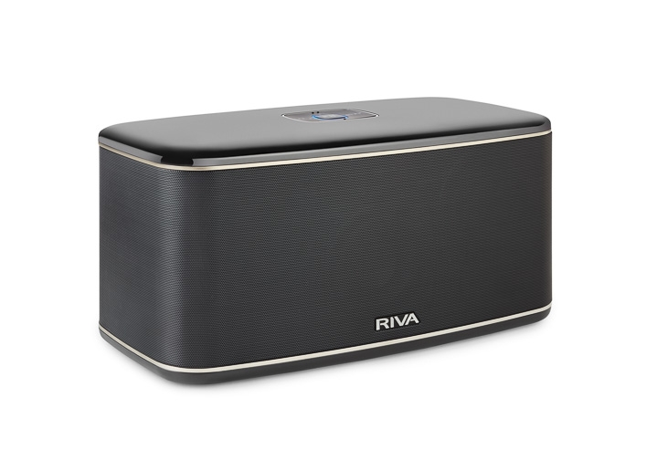

## Preamble

Recently got malfunctioned Riva Festival wireless speaker into my hands. Nothing worked except AUX input on the back side. No reaction to the control buttons, etc. RIVA Audio is out-of-business for several years as for now so there are virtually no chances to get any help with repair or parts replacement.

Trying to troubleshoot I managed to disassembly it and connect to the serial console. Inside the box I found [`Libre Wireless LS9`](https://www.librewireless.com/technologies.html) audio streaming module with custom host/amplifier board. The logic unit responsible for controlling the buttons and LS9 module is located on the host board itself and based on STM32 MCU. All the communication between MCU and LS9 module goes thru UART interface.

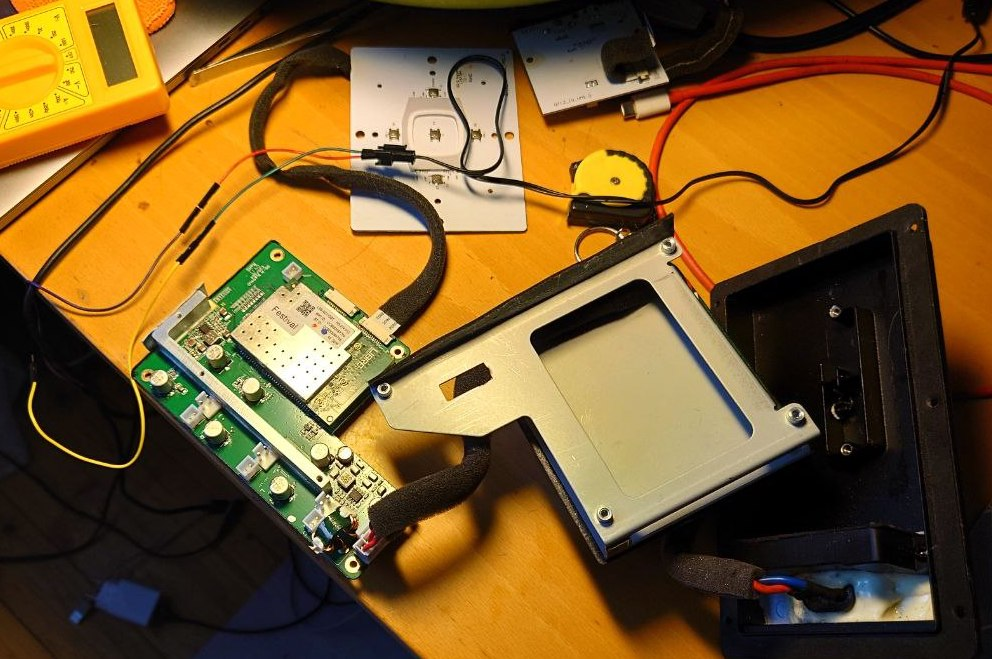

Though there was nothing in the logs directly indicating about MCU or communication interface problems but most probably it was the culprit. So after a week of worthless attempts to fix I decided to go another way - re-implement the same functionality using open source components! :)

## Hardware

Component | Description | Comment
--- | --- | ---
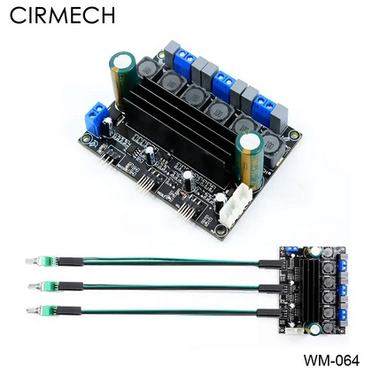| TPA3116 50W 2.1 Channel Amplifier [Aliexpress](https://www.aliexpress.com/item/1005001561676428.html) | A bit hissy but that was the only option I found which fits almost ideally to the existing enclosure
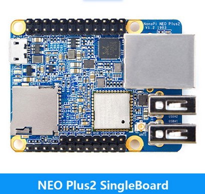 | NanoPi NEO Plus2 Allwinner H5/512MB RAM/8GB eMMC SBC [Aliexpress](https://www.aliexpress.com/item/1005004206663555.html)| NanoPI ARM Cortex A53 Single Board Computer. It has quite decent built-in DAC capable of up to 192kHz/32bit with Line-Out pins
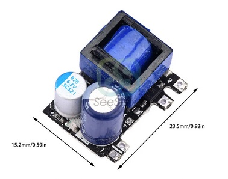 | AC-DC 220V to 5V 1000mA Buck Converter [Aliexpress](https://www.aliexpress.com/item/1005005021311232.html)| To avoid ground line noise I'm using separate power source to supply NanoPI SBC
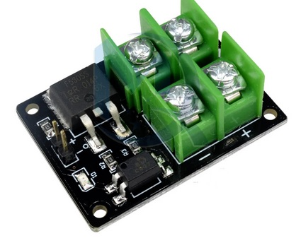| High Voltage 12V 24V 36V switch Mosfet Module [Aliexpress](https://www.aliexpress.com/item/1005003764524106.html)| Used to control amplifier power supply using GPIO (It's a good idea to switch off amplifier during idle time :)
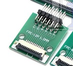| 2x FPC-FFC Adapter 1.0mm-12pin [Aliexpress](https://www.aliexpress.com/item/1005004016362789.html)| Used to interface extender & buttons/LED plates (connected with flexible flat cables) with SBC GPIO pins
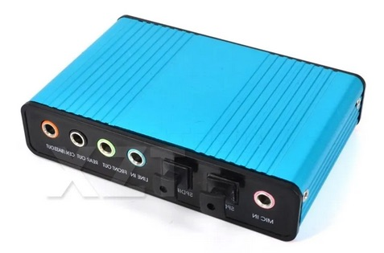| **OPTIONAL:** External USB2.0 Sound Card [Aliexpress](https://www.aliexpress.com/item/32815685327.html)| NanoPI SBC has no SPDIF Rx neither LINE-IN input so for additional wired AUX inputs like SPDIF I'm using external USB card

### Case modding

I have to get rid of the metal frame on the removable unit in order to fit the amplifier:
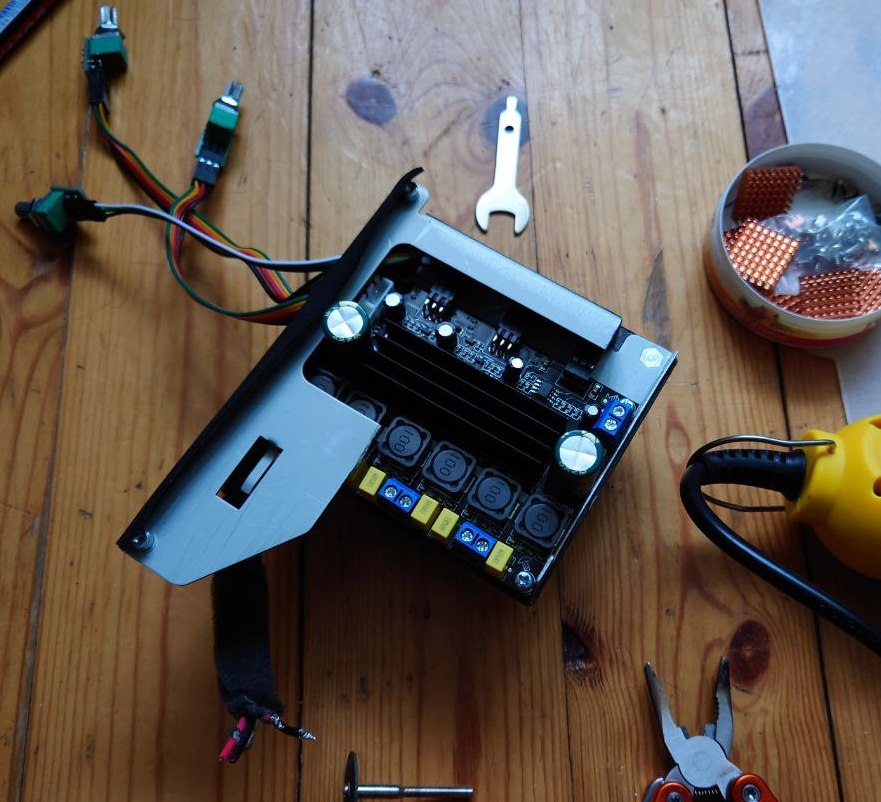

Powering up SBC from the same power unit the amplifier will be fed with gives insane amount of electrical line noise/interference.
So I decided to plug-in to the AC power supply circuit here in order to connect AC-DC buck converter (220V->5V1A) which will be used to power up NanoPI SBC exclusively:
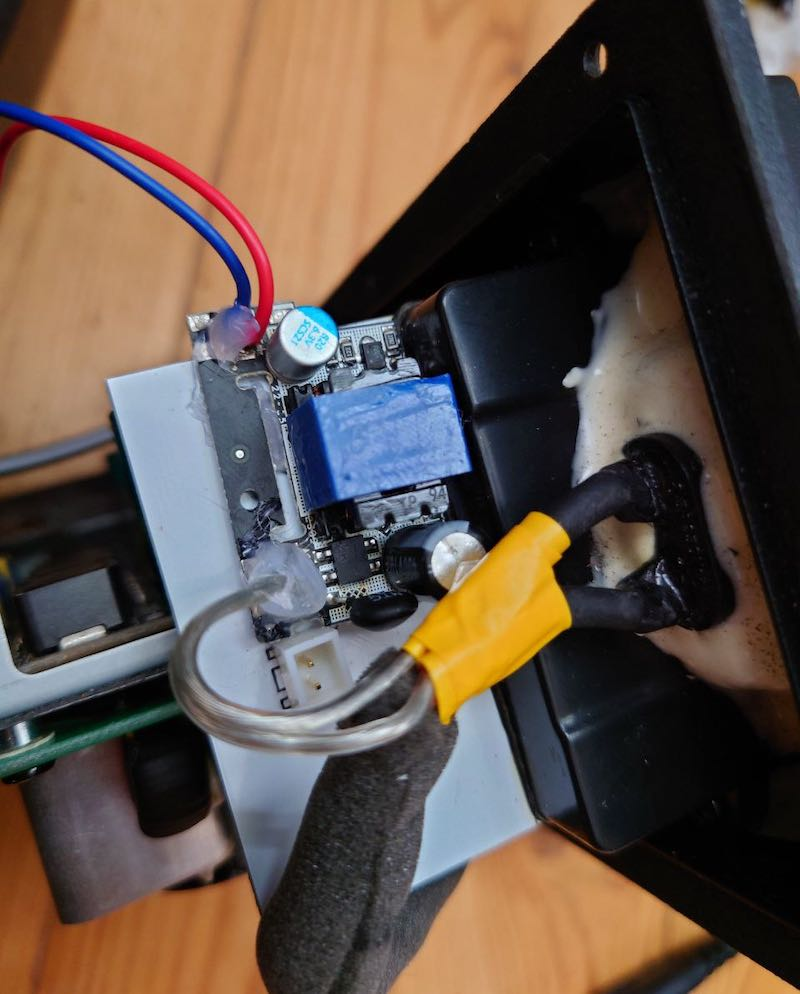

Drilled 3 holes in the top lid for the volume/treble/bass potentiometers:
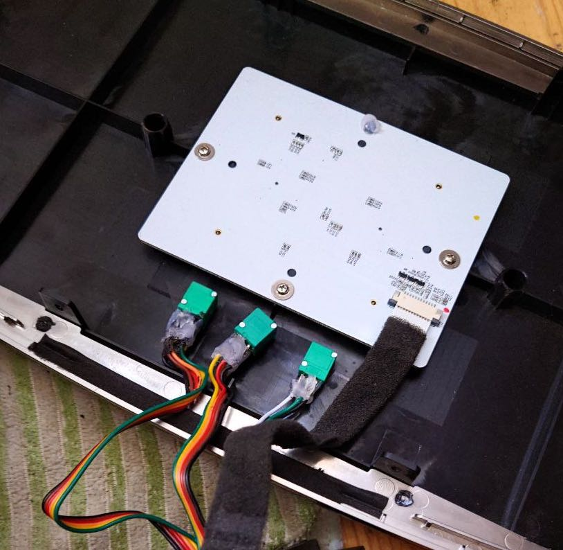

That's basically it about case modding. With NanoPI mounted and horn wires connected it looks like this:
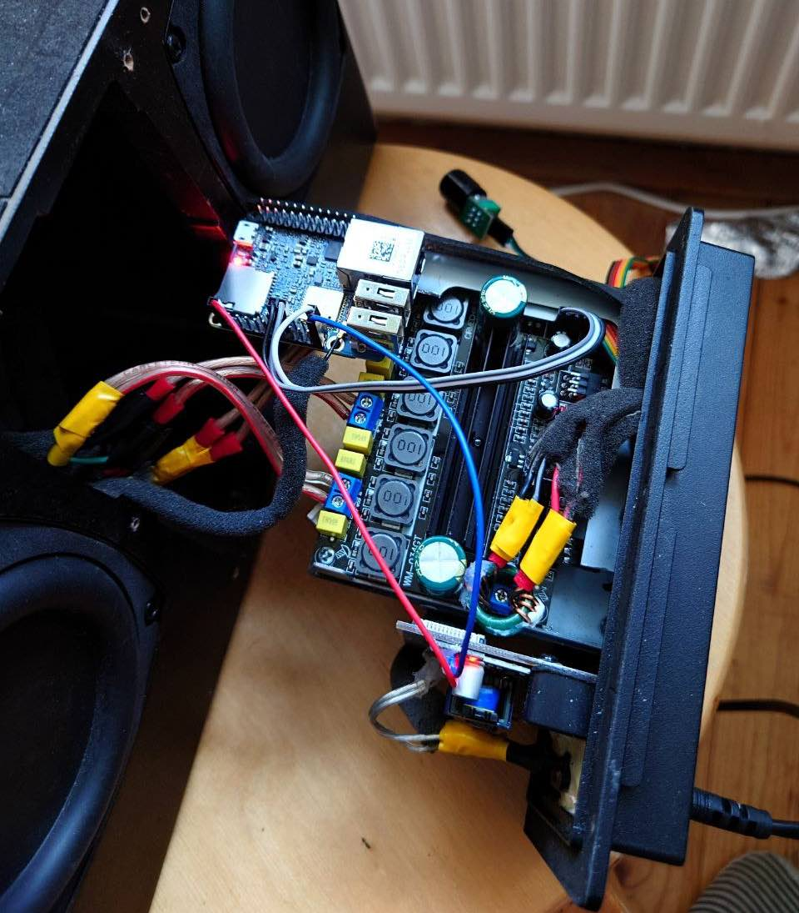

All the wires are connected, so this is a final view before assembly the housing:
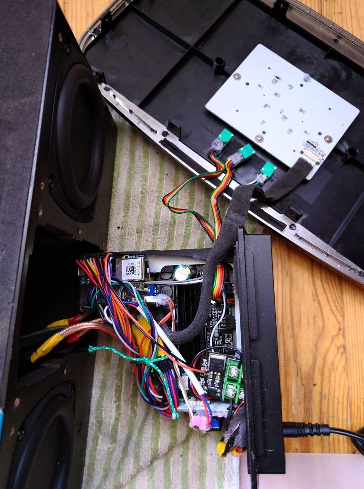

Closer view. Most of the wires here connect extension plates with NanoPI GPIO pins:
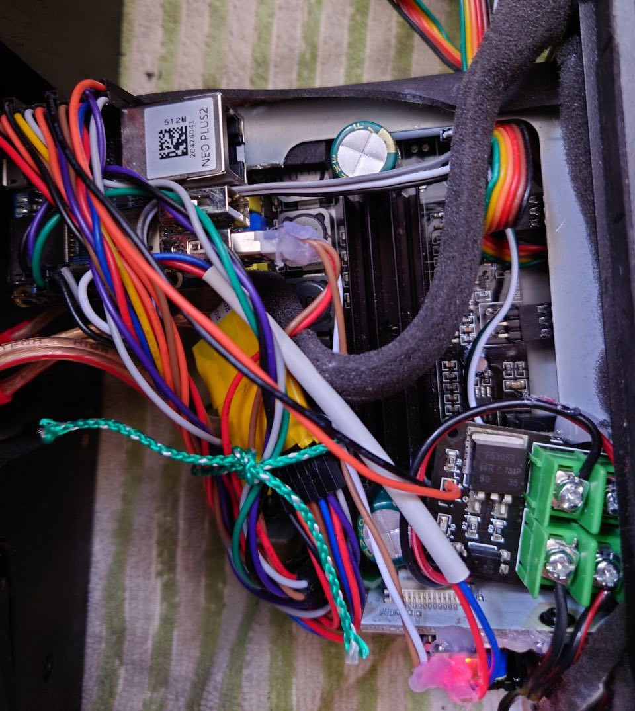

## Software

I decided not to use any existing pre-built Linux distributions like Armbian or whatever else exists to drive NanoPI SBC. They are huge and clumsy, overloaded with the stuff I do not really need.

So my approach was to build a minimal dsitro based on Alpine Linux. I'm not using Buildroot or any similiar tools, just a set of simple shell scripts & plain-text configuration files.

##### Alpine Linux image build system for various SBCs:
> [https://github.com/faust93/Alpine-Linux-SBC.git](https://github.com/faust93/Alpine-Linux-SBC.git)

##### Control daemon and helper scripts
To configure & control the speaker I use a set of scripts and simple daemon written in Go:

> [https://github.com/faust93/riva_festival_diy.git](https://github.com/faust93/riva_festival_diy.git)

Daemon provides WebUI as well (trying to mimic original UI):
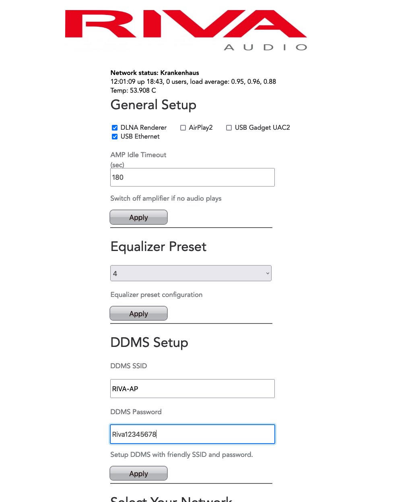

#### Other Components & Dependencies

Shairport Sync is an AirPlay audio player for Linux and FreeBSD. It plays audio streamed from Apple devices:
> [https://github.com/mikebrady/shairport-sync.git](https://github.com/mikebrady/shairport-sync.git)

GMediaRender fork - UPnP/DLNA media renderer for Linux:
> [https://github.com/hzeller/gmrender-resurrect.git](https://github.com/hzeller/gmrender-resurrect.git)

Alsaequal is a real-time adjustable equalizer plugin for ALSA:
> [https://github.com/raedwulf/alsaequal.git](https://github.com/raedwulf/alsaequal.git)
